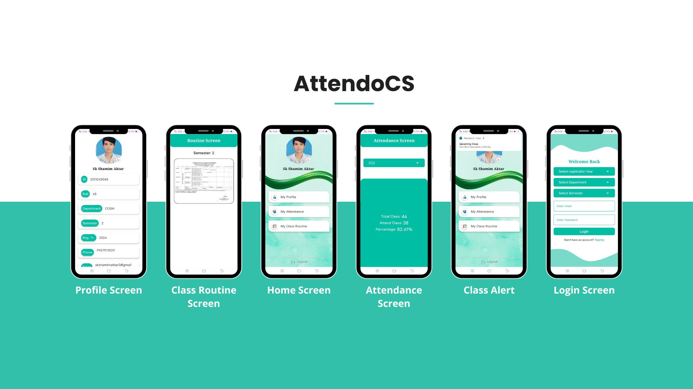
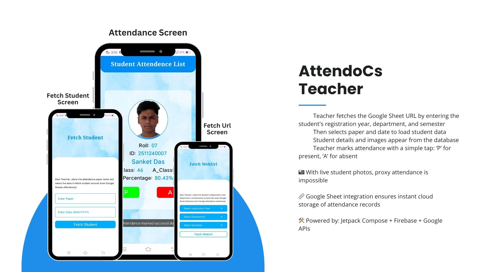
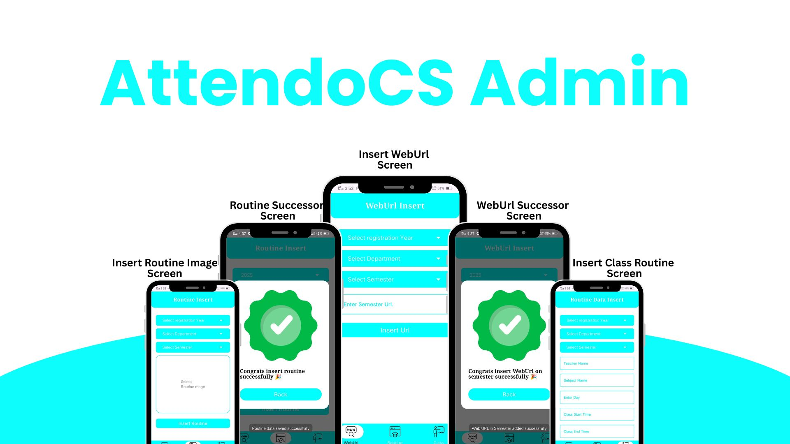

# AttendoCS 📲

**AttendoCS** is a smart attendance management application officially launched in the **Computer Science Department** of **Panskura Banamali College (Autonomous)**.  
It solves real-world problems like proxy attendance, paper waste, and manual delays with an efficient and transparent system.

  
  
  
*Sample UI of AttendoCS App*

---

## 🧠 How It Works

1. Teacher fetches the **Google Sheet URL** by entering:
   - Registration Year
   - Department
   - Semester

2. Teacher selects the **paper** and **date** to view the student list

3. Student details with **photos** are loaded from the database

4. Attendance is marked with a single tap:
   - ✅ `P` for Present
   - ❌ `A` for Absent

5. Attendance is **instantly saved to Google Sheets** – paperless and reliable!

---

## 🚀 Features

- 🔒 **Photo-Based Verification** — Prevents proxy attendance
- 📊 **Google Sheets Integration** — Auto-sync data to the cloud
- ⏰ **Class Reminder Alerts** — Alerts students 30 mins before class
- 📱 **Student Panel** — View and correct attendance errors
- ⚡ **Fast, Paperless & Real-Time**

---

## 🛠 Tech Stack

- **Jetpack Compose**
- **Firebase Firestore**
- **Firebase Authentication & Storage**
- **Google Sheet API**
- **Google Calendar API**
- **Retrofit (for API calls)**

---

## 🏫 Institution

This application is actively used in:
**Computer Science Department**  
**Panskura Banamali College (Autonomous)**

---

## 👨‍💻 Developed By

**Sujoy Maity**  
📍 Android Developer | Panskura Banamali College  

---

> “A modern solution to eliminate proxy attendance and bring automation into classrooms.”

#AttendoCS #SujoyMaity #AndroidDevelopment #SmartAttendance #JetpackCompose #Firebase #PanskuraBanamaliCollege #NoProxy
